# eFactura Sync — Ghid de utilizare

Descarcă facturile **primite** din SPV (ANAF e-Factura) și le salvează pe calculatorul tău ca **PDF**, organizate pe ani și luni, cu un fișier CSV pentru contabil. Aplicația rulează local, fără instalare, pe macOS și Windows; interfața se deschide în browserul tău.

[TOC]

## 1. Ce ai nevoie înainte de a începe

1. **Un certificat digital calificat** (DigiSign, certSIGN, AlfaTrust…), înregistrat în SPV pentru firma ta, iar firma înrolată în e-Factura. Fără el nu te poți autentifica la ANAF. Dacă ești contabil: certificatul tău trebuie să aibă drepturi în SPV (împuternicire) pentru **fiecare** firmă pe care vrei să o gestionezi.
2. **O aplicație OAuth înregistrată la ANAF** — o singură dată, în portalul ANAF:
    1. intră pe **anaf.ro → Servicii online → Înregistrare aplicații developeri → Înregistrare în vederea accesării serviciilor web**;
    2. autentifică-te în SPV (cu certificatul sau cu utilizator și parolă);
    3. creează un profil OAuth: orice nume (de exemplu `eFactura Sync`), **Callback URL exact `https://localhost/callback`**, bifează serviciul **EFACTURA**, apoi *Generare*;
    4. copiază **Client ID** și **Client secret** — aplicația ți le va cere la prima pornire. Client secret se afișează o singură dată; păstrează-l într-un loc sigur.

> Aplicația nu trimite date nicăieri în afară de ANAF. Setările, jurnalul și baza de date stau în dosarul `.anaf_invoices` din dosarul tău de utilizator.

## 2. Instalare

Descarcă ultima versiune din pagina de *Releases*: <https://github.com/ximi/efactura-sync/releases/latest>

| Sistem | Fișier | Ce faci |
|---|---|---|
| Mac cu Apple Silicon (2020+) | `eFactura-Sync-macos-arm64.zip` | dezarhivează, mută `eFactura Sync.app` în *Applications* |
| Mac cu procesor Intel | `eFactura-Sync-macos-x86_64.zip` | la fel |
| Windows 10/11 | `eFactura-Sync-windows-x64.exe` | pune fișierul unde vrei (de exemplu pe Desktop) |

Aplicația **nu este semnată digital** în această versiune. Sistemul de operare afișează de aceea o avertizare — **o singură dată**:

- **macOS:** la prima deschidere apare „nu poate fi verificată”. Închide mesajul, apoi **click dreapta pe `eFactura Sync.app` → Deschide → Deschide**. Dacă pe macOS 15+ butonul *Deschide* nu apare, mergi în *System Settings → Privacy & Security*, derulează până la mesajul despre eFactura Sync și apasă *Open Anyway*.
- **Windows:** la avertizarea SmartScreen apasă **Mai multe informații (More info) → Rulează oricum (Run anyway)**. Unele programe antivirus verifică suplimentar fișierul la prima pornire; este normal să dureze câteva secunde.

Aplicația nu are fereastră proprie: pornește un serviciu local pe calculatorul tău și deschide browserul la adresa `http://127.0.0.1:8765`. Dacă browserul nu se deschide singur, tastează adresa manual.

## 3. Prima pornire: asistentul de configurare

La prima pornire se deschide un asistent în trei pași.

**Pasul 1 — ce ai nevoie.** Rezumatul din capitolul 1, cu legătura către pagina ANAF de înregistrare a aplicației.

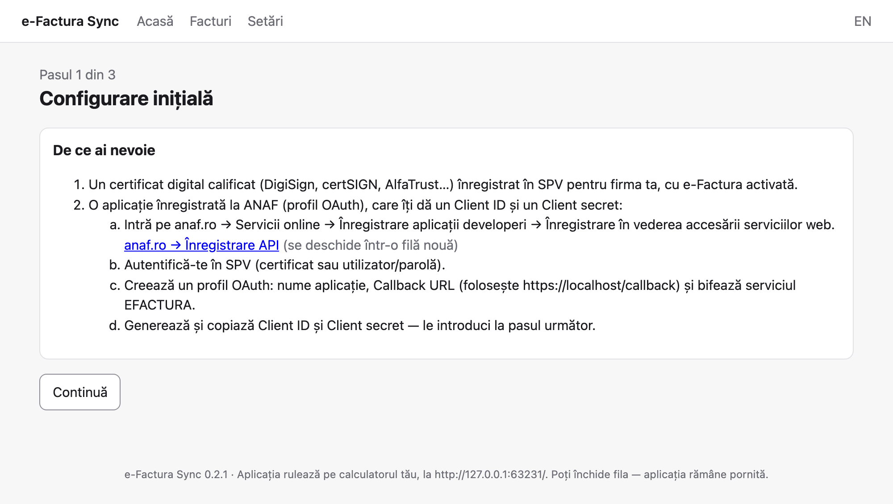

**Pasul 2 — datele firmei și ale aplicației.** Completează numele firmei, Client ID, Client secret și CUI-ul firmei (doar cifre, fără „RO”). Dosarul pentru facturi este propus automat (`Documents/Facturi e-Factura`); apasă *Alege…* ca să alegi altul. Sub *Setări avansate* găsești mediul (Producție / Test) și Callback URL — nu le modifica decât dacă știi de ce.

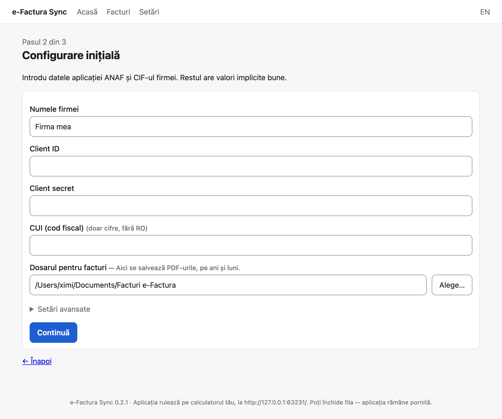

**Pasul 3 — autentificarea la ANAF.** Vezi capitolul următor.

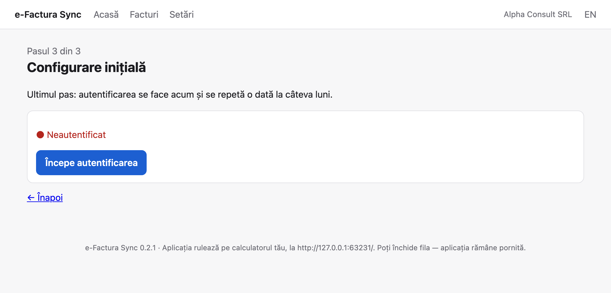

## 4. Autentificarea la ANAF

Autentificarea se face o dată la câteva luni (ANAF păstrează sesiunea aproximativ 90 de zile, iar aplicația o reînnoiește singură cât timp este valabilă).

1. Apasă **Începe autentificarea**. Aplicația afișează o adresă lungă de pe `logincert.anaf.ro`.
2. Deschide adresa **într-un browser în care este disponibil certificatul digital** (pe Windows: Chrome sau Edge; pe macOS: de obicei Safari sau Chrome). Poți da click pe ea sau apăsa *Copiază adresa* și o lipi în celălalt browser.
3. Browserul îți cere să **alegi certificatul** și PIN-ul tokenului. Autorizează aplicația.
4. Ești redirecționat către `https://localhost/callback…` — **pagina nu se va încărca; este normal.** Copiază **adresa completă** din bara de adrese a browserului.
5. Întoarce-te în aplicație, lipește adresa în câmp și apasă **Finalizează**.

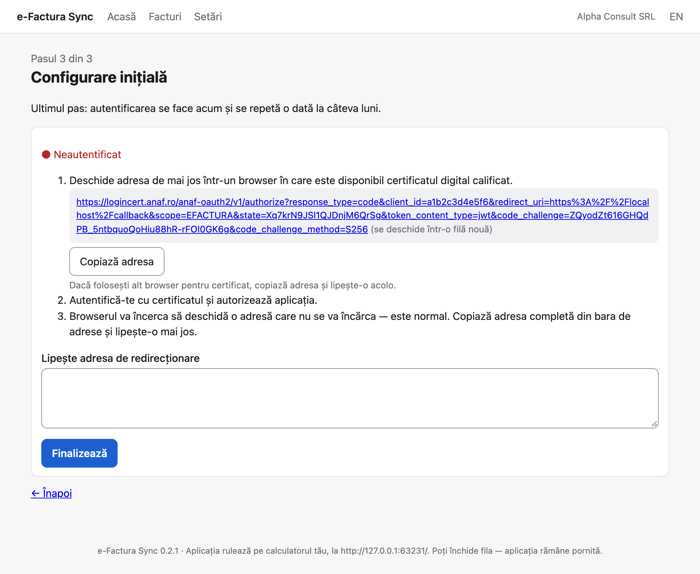

### Dacă ANAF refuză accesul (`access_denied`)

Înseamnă că autentificarea cu certificatul nu s-a finalizat; setările aplicației nu sunt de vină. Ce ajută cel mai des: autentifică-te mai întâi pe **pfinternet.anaf.ro** cu certificatul, apoi deschide adresa de autorizare **în același browser**. Aplicația afișează și celelalte verificări (programul certificatului pornit, fereastra de alegere a certificatului, drepturile în SPV) și un buton *Reia autentificarea*.

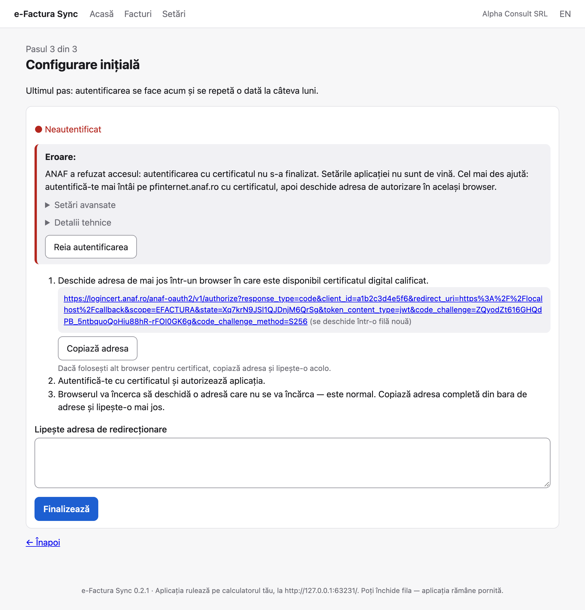

## 5. Sincronizarea facturilor

Pagina **Acasă** arată starea: câte facturi ai descărcat, câte în luna curentă, câte sunt fără PDF și când a fost ultima sincronizare. Dacă nu ești autentificat, un mesaj te trimite la Setări.

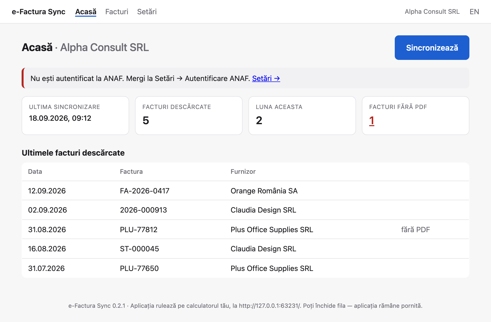

Apasă **Sincronizează**. Aplicația caută facturile primite în ultimele 60 de zile, descarcă doar ce nu are deja, generează PDF-ul fiecărei facturi prin serviciul oficial ANAF și le pune în dosar, pe ani și luni. Jurnalul arată progresul; la final vezi câte facturi noi au fost descărcate.

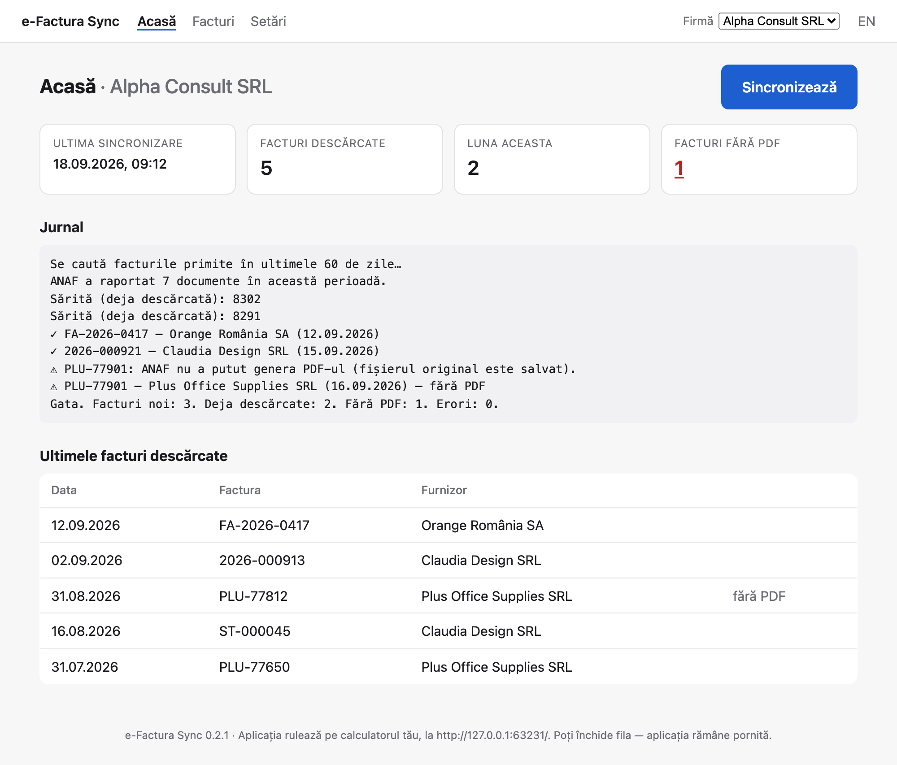

Sincronizarea se poate repeta oricând — facturile deja descărcate sunt recunoscute și sărite. Facturile mai vechi de 60 de zile nu pot fi descărcate prin acest mecanism (limitare ANAF).

## 6. Facturile

Pagina **Facturi** listează facturile firmei selectate, cu filtre pe lună și furnizor. Butonul **PDF** deschide factura. Facturile storno (note de creditare) sunt marcate. *Deschide dosarul* deschide dosarul în Finder / Explorer.

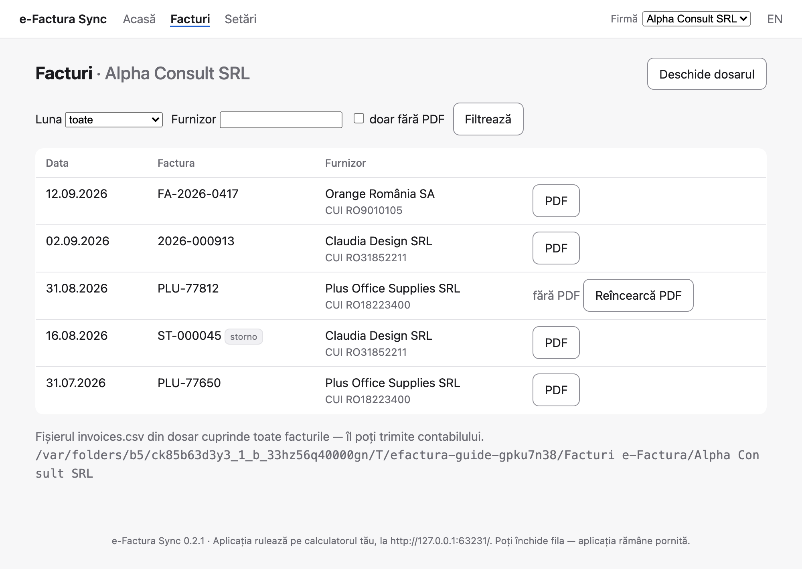

În dosar, fișierul **`invoices.csv`** cuprinde toate facturile (număr, furnizor, CUI, dată, fișier) — îl poți trimite contabilului sau deschide în Excel. Lângă fiecare PDF stau fișierul XML original și arhiva ZIP primită de la ANAF (cu semnătura ANAF), pentru arhivare.

### Facturi fără PDF

Uneori ANAF nu poate genera PDF-ul (fișierul original rămâne salvat și este valabil pentru contabilitate). Cardul *Facturi fără PDF* de pe Acasă duce la lista lor, unde poți apăsa **Reîncearcă PDF** pentru o factură sau **Reîncearcă toate PDF-urile lipsă**.

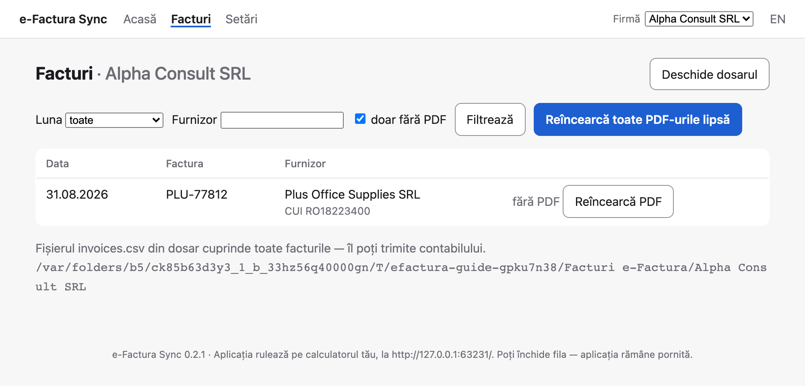

## 7. Mai multe firme (pentru contabili)

În **Setări → Firme** adaugi fiecare firmă (nume și CUI); dosarul ei de facturi este propus automat (`Documents/Facturi e-Factura/<numele firmei>`). Când există mai multe firme, în antet apare un **selector de firmă**. Aplicația lucrează mereu pentru **firma selectată**: *Sincronizează*, *Facturi* și dosarul sunt ale ei. Autentificarea la ANAF este una singură — certificatul tău trebuie să aibă drepturi în SPV pentru fiecare firmă.

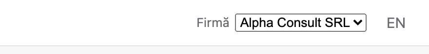

## 8. Setări

- **Datele firmei și ale aplicației** — cele din asistent; *Salvează* după modificări.
- **Firme** — lista firmelor, *Selectează*, *Șterge*, *Adaugă firmă*.
- **Autentificare ANAF** — starea sesiunii și butonul de autentificare.
- **Diagnostic** — *Copiază informații de diagnostic* pune în clipboard un text fără date confidențiale, util dacă ceri ajutor.
- **Limba** — comutatorul RO/EN din antet.
- **Închide aplicația** — oprește serviciul local. Aplicația se închide și singură după 30 de minute de inactivitate; o pornești din nou ca de obicei. Dacă e deja pornită, un nou dublu-click doar redeschide pagina.

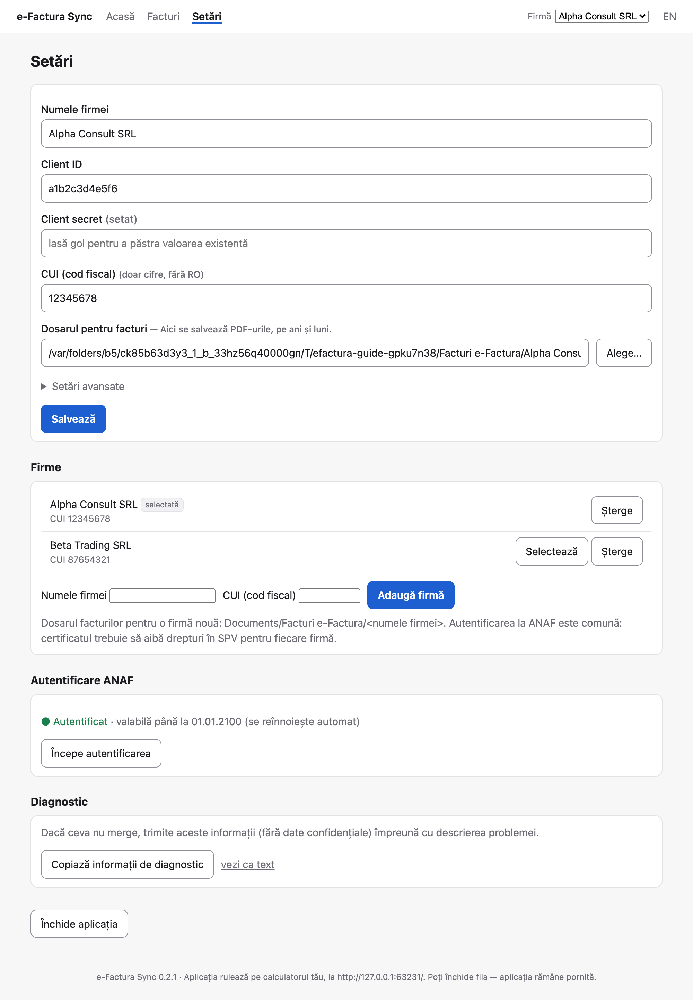

## 9. Probleme frecvente

| Ce vezi | Ce înseamnă / ce faci |
|---|---|
| *ANAF a refuzat accesul (access_denied)* | Certificatul nu a fost prezentat. Vezi capitolul 4. |
| *Sesiunea ANAF a expirat* | Autentifică-te din nou din Setări (o dată la ~90 de zile). |
| *Nu s-a putut contacta ANAF* | Verifică conexiunea la internet; ANAF are uneori întreruperi — încearcă mai târziu. |
| *Pagina a expirat* | Aplicația a fost repornită între timp; reîncarcă pagina (Cmd+R / F5). |
| *Fișierul invoices.csv este deschis în alt program* | Închide fișierul în Excel și sincronizează din nou. |
| Browserul nu se deschide la pornire | Deschide manual `http://127.0.0.1:8765`. |
| Nimic nu se întâmplă la dublu-click | Vezi capitolul 2 (avertizarea de securitate). Pe Windows, așteaptă câteva secunde la prima pornire. |

Jurnalul tehnic se află în `~/.anaf_invoices/ui.log` (Windows: `C:\Users\<nume>\.anaf_invoices\ui.log`).

## 10. Actualizare

Descarcă versiunea nouă și înlocuiește aplicația. Setările, autentificarea și facturile descărcate rămân neschimbate. Versiunea instalată apare în subsolul fiecărei pagini.

---

eFactura Sync este software liber (licență MIT): <https://github.com/ximi/efactura-sync>. Nu este un produs ANAF.
